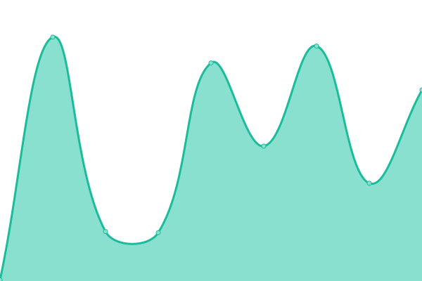
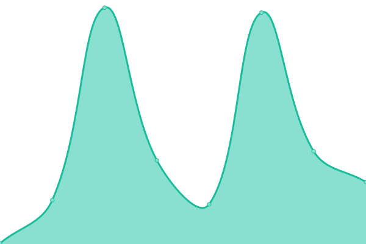
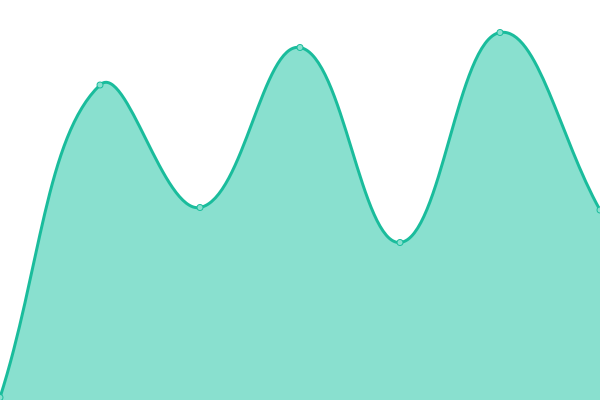
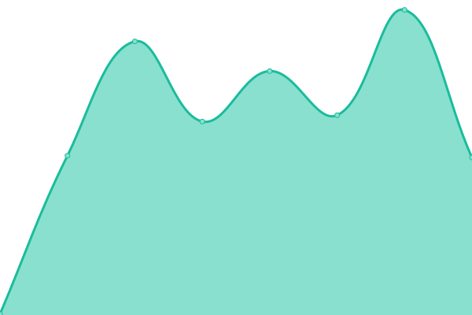
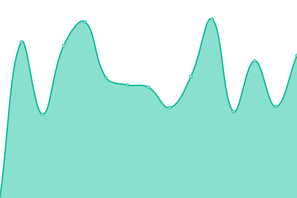

# [📈 Live Status](https://status.downly.net): <!--live status--> **🟧 Partial outage**

This repository contains the open-source uptime monitor and status page for [Thexyz](https://www.thexyz.com), powered by [Upptime](https://github.com/upptime/upptime).

With [Upptime](https://upptime.js.org), you can get your own unlimited and free uptime monitor and status page, powered entirely by a GitHub repository. We use [Issues](https://github.com/Thexyz/Downly/issues) as incident reports, [Actions](https://github.com/Thexyz/Downly/actions) as uptime monitors, and [Pages](https://status.downly.net) for the status page.

<!--start: status pages-->
<!-- This summary is generated by Upptime (https://github.com/upptime/upptime) -->
<!-- Do not edit this manually, your changes will be overwritten -->
<!-- prettier-ignore -->
| URL | Status | History | Response Time | Uptime |
| --- | ------ | ------- | ------------- | ------ |
|  [Google](https://www.google.com) | ✅ Up | [google.yml](https://github.com/Thexyz/downly/commits/HEAD/history/google.yml) | 

 72ms
     
 | 

<a href="https://downly.net/history/google">100.00%</a>
    

|  [Wikipedia](https://en.wikipedia.org) | ✅ Up | [wikipedia.yml](https://github.com/Thexyz/downly/commits/HEAD/history/wikipedia.yml) | 

 213ms
     
 | 

<a href="https://downly.net/history/wikipedia">100.00%</a>
    

|  [Hacker News](https://news.ycombinator.com) | ✅ Up | [hacker-news.yml](https://github.com/Thexyz/downly/commits/HEAD/history/hacker-news.yml) | 

 233ms
     
 | 

<a href="https://downly.net/history/hacker-news">100.00%</a>
    

|  [Twitter](https://twitter.com) | 🚨 Down | [twitter.yml](https://github.com/Thexyz/downly/commits/HEAD/history/twitter.yml) | 

 183ms
     
 | 

<a href="https://downly.net/history/twitter">0.00%</a>
    

|  [Facebook](https://facebook.com) | ✅ Up | [facebook.yml](https://github.com/Thexyz/downly/commits/HEAD/history/facebook.yml) | 

 477ms
     
 | 

<a href="https://downly.net/history/facebook">100.00%</a>
    

|  [IMDB](https://www.imdb.com) | ✅ Up | [imdb.yml](https://github.com/Thexyz/downly/commits/HEAD/history/imdb.yml) | 

 1186ms
     
 | 

<a href="https://downly.net/history/imdb">100.00%</a>
    

|  [Microsoft](https://www.microsoft.com) | 🚨 Down | [microsoft.yml](https://github.com/Thexyz/downly/commits/HEAD/history/microsoft.yml) | 

 16442ms
     
 | 

<a href="https://downly.net/history/microsoft">0.00%</a>
    

|  [Amazon](https://amazon.com) | ✅ Up | [amazon.yml](https://github.com/Thexyz/downly/commits/HEAD/history/amazon.yml) | 

 351ms
     
 | 

<a href="https://downly.net/history/amazon">100.00%</a>
    

|  [Reddit](https://www.reddit.com) | 🚨 Down | [reddit.yml](https://github.com/Thexyz/downly/commits/HEAD/history/reddit.yml) | 

 31ms
     
 | 

<a href="https://downly.net/history/reddit">0.00%</a>
    

|  [Apple](https://www.apple.com) | ✅ Up | [apple.yml](https://github.com/Thexyz/downly/commits/HEAD/history/apple.yml) | 

 87ms
     
 | 

<a href="https://downly.net/history/apple">100.00%</a>
    

|  [eBay](https://www.ebay.com) | ✅ Up | [e-bay.yml](https://github.com/Thexyz/downly/commits/HEAD/history/e-bay.yml) | 

 544ms
     
 | 

<a href="https://downly.net/history/e-bay">100.00%</a>
    

|  [Linkedin](https://www.linkedin.com) | ✅ Up | [linkedin.yml](https://github.com/Thexyz/downly/commits/HEAD/history/linkedin.yml) | 

 333ms
     
 | 

<a href="https://downly.net/history/linkedin">100.00%</a>
    

|  [Thexyz](https://www.thexyz.com) | ✅ Up | [thexyz.yml](https://github.com/Thexyz/downly/commits/HEAD/history/thexyz.yml) | 

 562ms
     
 | 

<a href="https://downly.net/history/thexyz">95.66%</a>
    

<!--end: status pages-->

[**Visit our status website →**](https://status.downly.net)

## 📄 License

- Powered by: [Upptime](https://github.com/upptime/upptime)
- Code: [MIT](./LICENSE) © [Thexyz](https://www.thexyz.com)
- Data in the `./history` directory: [Open Database License](https://opendatacommons.org/licenses/odbl/1-0/)
